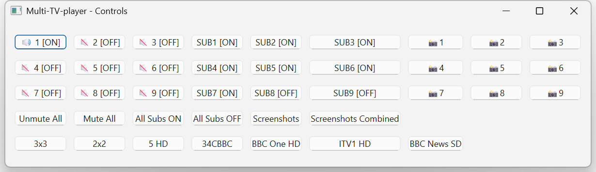

# multi-tv-player

A Python application to display multiple IPTV streams simultaneously using VLC, with a PySide6-based control panel for muting, subtitles, screenshots, and group switching.

⚠️ **Note:** This player currently only works on **Windows** (uses `widget.winId()` with `set_hwnd`, and audio backend is Windows-specific).




---

## Requirements

- **TVHeadend server** or any HTTP playlist serving an M3U-style list (must be accessible at a URL)
- Python 3.8+
- VLC media player installed and available in your system PATH
- Python packages:
  - `PySide6`
  - `python-vlc`
  - `screeninfo`
  - `requests`
  - `Pillow`

Install dependencies via:

```bash
pip install -r requirements.txt
```

---

## How It Works

1. On startup, the app fetches an M3U playlist from:
   ```
   http://192.168.1.73:9981/playlist
   ```
   Parses lines to extract channel names, numbers (`tvg-chno`), and stream URLs.

2. `MultiPlayerApp` creates a full-screen grid of VLC players on monitor 1, based on the currently selected "group" of channels (e.g., `['101','102','103','104']` forms a 2×2 grid).

3. VLC backend is configured with:
   ```python
   vlc.Instance('--quiet', '--network-caching=100', "--aout=directsound")
   ```
   Grid layout adjusts to 1×1, 2×2, or 3×3 based on group size.

4. Keyboard shortcut **F11** toggles fullscreen/normal window.

---

## Control Panel

A separate window (`ControlsWindow`) provides:

- Individual Mute/Unmute per stream  
- Subtitle ON/OFF per stream  
- Screenshot buttons (per stream or combined grid)  
- Global controls: Unmute All, Mute All, All Subs ON/OFF, Screenshots, Combined Screenshot  
- Buttons to switch between predefined stream groups

### Keyboard Shortcuts

- `M` – Toggle mute/unmute all players  
- `S` – Toggle subtitles on/off all players  
- `1`–`9` – Mute all except specified player  

Screenshots are saved to:
```
~/Downloads/tvplayer_screenshots
```
Files are named with the timestamp and safe channel name. Combined screenshots merge the grid into one image.

---

### Configuration

All application settings are now managed through a **YAML configuration file**, providing a cleaner and more flexible way to customize your setup.

### `config.yaml`

A file named `config.yaml` (or `example_config.yaml`) should be present in the same directory as the script. If `config.yaml` doesn't exist, the script will fall back to `example_config.yaml`. It's recommended to **rename `example_config.yaml` to `config.yaml`** and then modify it with your personal settings, as updates to the repository may overwrite changes to `example_config.yaml`.

Here's an example of the `config.yaml` structure:

```yaml
# Rename this file to config.yaml for custom settings.

playlist_url: "[http://192.168.1.73:9981/playlist](http://192.168.1.73:9981/playlist)" # Your M3U playlist URL

stream_groups: # Define groups of channel numbers for quick switching
  3x3: ['101', '102', '103', '104', '105', '204', '203', '107', '106']
  2x2: ['101', '102', '103', '104']
  5 HD: ['105']
  34CBBC: ['107', '106', '204', '203']
  BBC One HD: ['101']
  ITV1 HD: ['103']
  BBC News SD: ['231']
```

---

## Running the App

```bash
python multi_tv_player.py
```

This launches the full-screen video grid. The control panel appears automatically.

---

## Notes & Limitations

- **Windows-only**: uses `player.set_hwnd`, and audio backend is Windows-specific
- No error management for unavailable streams
- Limited subtitle support, selects first available track
- Only supports M3U-style playlists served via HTTP

---

## License

MIT License
